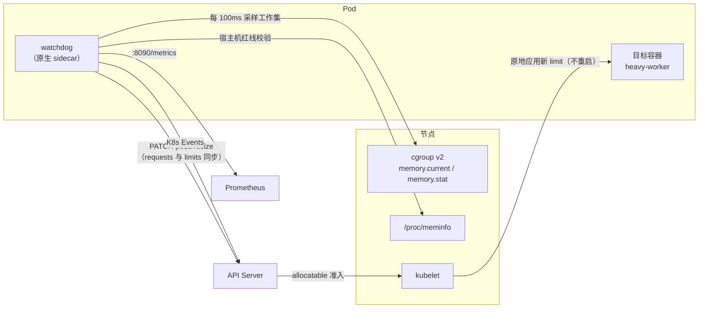

# k8s-oom-watchdog — Kubernetes 原地垂直扩缩容内存看门狗 Sidecar

[English](README.en.md) | [简体中文](README.md)


**通用**的容器内存看门狗 Sidecar，适用于任何长周期、内存尖刺型的工作负载（批处理、数据导入、报表聚合、Celery/RQ worker、ETL 任务等）：高频采样目标容器的 cgroup v2 **工作集内存**，在内核 OOM-kill 之前，通过 Kubernetes **原地垂直扩缩容（In-Place Pod Resize，`/resize` 子资源）** 抬高内存上限，任务结束后自动缩回，全程不重启容器、不打断长周期任务。

监督哪个容器由 `WATCHDOG_TARGET_CONTAINER` 环境变量指定（chart 参数 `targetContainer`），与业务技术栈完全解耦——本文与示例模板以 `heavy-worker`（一个 Celery heavy worker，本项目的起源场景）作为目标容器示例。

## 架构



## 快速上手

**1. 构建并推送镜像**（arm64 示例，amd64 调整 `--platform` 即可）：

```bash
docker buildx build --platform linux/arm64 \
  -t <your-registry>/memory-watchdog:<tag> \
  --push .
```

镜像内通过 pip 安装了固定版本的 `kubernetes` 客户端（resize 子资源方法需要 ≥33 版本，旧版本走 raw API 兜底路径）。

**2. 移植部署模板**：`deploy/helm/` 提供 watchdog 注入所需的全部模板（Deployment sidecar 片段、RBAC、ValidatingAdmissionPolicy、ServiceMonitor）与 values 示例——它们引用了源 chart 的模板助手，移植到你的 chart 时按 [deploy/README.md](deploy/README.md) 的说明替换；告警规则（`deploy/monitoring/`）随监控栈下发。

**3. 启用**：确认下方前提条件全部满足后，设置 `watchdog.enabled: true` 发布。验证方式：

```bash
kubectl logs -f <pod> -c watchdog        # 看门狗日志
kubectl describe pod <pod>               # 扩缩容以 K8s Event 挂在 pod 上
curl <pod-ip>:8090/metrics               # Prometheus 指标
```

## 前提条件

| 条件 | 要求 | 不满足时的行为 |
|---|---|---|
| Kubernetes 版本 | **≥ 1.33**（EKS ≥ 1.34），`/resize` 子资源与原生 sidecar（initContainer `restartPolicy: Always`）均 GA | watchdog 首次 PATCH 收到 404/405 时打出明确 CRITICAL 日志并退出，反复重启触发 `MemoryWatchdogSidecarRestarting` 告警 |
| Cgroup | v2（systemd driver，EKS AL2023 默认） | 启动时定位 cgroup 失败并退出 |
| Pod Security | 命名空间需允许 hostPath 只读挂载（`/sys/fs/cgroup`、`/proc/meminfo`），PSA `restricted` 档位会拒绝 | Pod 无法创建 |
| 告警（监控栈） | 由监控栈统一承载：`deploy/monitoring/prometheus-rules.yaml`（6 条 PrometheusRule）+ `deploy/monitoring/alertmanager-config.yaml`（经告警网关送达 IM 告警群，示例通道名 your-alert-channel），随监控栈发布生效 | 未部署规则则只有指标与 K8s 事件，无主动告警——启用 watchdog 前必须先确认规则已下发 |

## 工作机制（概览）

每条机制的实现细节与设计论证见 **[docs/design.md](docs/design.md)**。

1. **定位 cgroup**：启动时经 mountinfo 或 POD_UID glob 定位目标容器的 cgroup 目录（兼容私有 cgroup namespace）；主容器重启后自动重新定位，不陷入盲区。
2. **工作集口径**：`memory.current − inactive_file`，与 kubelet 的 OOM 记账一致，IO 密集任务不会因 page cache 虚高误扩容。
3. **扩容**：工作集 ≥ 80% limit 时按步长 PATCH `/resize`，**requests 与 limits 同步抬升**——借用的内存全程纳入调度记账，宿主机与邻居 pod 始终安全。
4. **宿主机红线**：`新 limit + 宿主机其他负载 < 90% × 物理内存` 才放行；空间不足自适应降级步长，彻底没空间则熔断告警。
5. **失败处理**：Infeasible 或 60s 超时 → 回滚 spec + 高危告警 + 10 分钟熔断，绝不无限等待。
6. **缩容**：工作集 < 40% 且稳定 180s 才逐级回落，与扩容线形成宽迟滞带；缩容在途遇到新压力立即撤回，外部 resize 一律收编监督而非覆盖。
7. **Baseline 持久化**：初始 limit/requests 写入 pod annotation，sidecar 重启不丢账。
8. **失效自省**：读不到宿主机内存时拒绝扩容并持续高危告警，绝不静默跳过。
9. **原生 sidecar**：先于主容器启动、晚于其终止，覆盖含超长优雅退出期的完整生命周期；非 root、只读根文件系统、drop 全部 capabilities。
10. **可观测性**：Prometheus 指标 + K8s Events + 心跳驱动的 `/healthz`；告警由监控栈统一承载（6 条 PrometheusRule），watchdog 只负责秒级闭环处置与打点。

## 部署参数（`values.yaml`）

```yaml
worker:
  watchdog:
    enabled: false           # 默认关闭；开启前确认集群版本满足前提
    threshold: 0.8           # 扩容水位（工作集/limit）
    pollInterval: 0.1        # 采样周期（秒）
    memoryStep: "2Gi"        # 扩容步长
    maxMemoryFactor: 2.0     # 扩容上限 = 该倍数 × baseline（各租户自动适配），须 > 1.0
    hostCeiling: 0.90        # 宿主机物理内存红线
    allowBlindScaleup: false # 读不到宿主机内存时是否允许盲扩半步长
    metricsPort: 8090        # /metrics 与 /healthz 端口
    repository: "registry.example.com/memory-watchdog"
    tag: "v1.8"
```

告警不在 chart 内配置——由监控栈统一下发（见"前提条件"表）。扩容上限只有 `maxMemoryFactor × baseline` 一种模式，刻意不提供绝对值上限（设计取舍见 [docs/design.md](docs/design.md#扩容上限的设计取舍)）。

## 已知限制（摘要）

每条限制的完整论证见 **[docs/design.md](docs/design.md#已知限制与论证)**。

- **抢救窗口有物理上界**：持续分配速率超过"余量 ÷ 抢救链路耗时"（16Gi baseline 下约 ≥1GiB/s）的突发仍会 OOM——原地 resize 机制的固有上界，对已知尖刺任务应调低 `threshold` 或抬高 baseline。
- **同节点多看门狗竞态**：后果被 kubelet allocatable 准入降级为"后到者被拒并回滚"，不会宿主机超卖。
- **RBAC 粒度**：SA 名义上可 patch 命名空间内任意 pod，由 projected token + ValidatingAdmissionPolicy（7 条 CEL 校验）双层收窄到"仅目标容器的 memory resize"。
- **Infeasible 是设计内失败方向**：节点紧张时扩容被 kubelet 拒绝，自动回滚 + 熔断；频繁出现说明节点容量真的不足。
- **不触发节点自动扩容**：Infeasible 不产生 Pending pod，cluster-autoscaler / Karpenter 无感知，需人工扩节点。
- **镜像默认 arm64**：基础镜像为多架构官方镜像，构建时调整 `--platform` 即可支持 amd64。
- **sidecar 失效 = 上限停留在 baseline**：不会比不启用更差，但失去 OOM 抢救；对应告警已随监控栈落地。
- **借用期间 requests 临时抬升**：回落 baseline 时自动恢复初始 requests，超卖形态的调度余量完整归还。
- **主容器不再挂载 SA token**：`automountServiceAccountToken: false`，token 仅挂给 watchdog 容器。
- **watchdog 自身 ~70Mi 常驻**：严禁在其容器内 exec 会 import kubernetes 包的诊断脚本（会挤爆 100Mi limit）。

## 失败模式处置

| 现象 | 含义 | 处置 |
|---|---|---|
| 告警 `MemoryWatchdogResizeFailed` | 节点容量不足，kubelet 拒绝（Infeasible）或超时未应用 | 扩容节点或横向分流；watchdog 已自动回滚 spec 并熔断 10 分钟 |
| 日志 CRITICAL "看门狗失去宿主机视野"（指标 `watchdog_blocked_total{reason="no_host_stats"}`） | `/host/proc/meminfo` 挂载异常 | 检查 hostPath 挂载与节点状态；此状态下不会执行任何扩容 |
| 告警 `MemoryWatchdogHostMemoryExhausted` | 节点整体拥塞，无安全空间 | 扩容节点；这是设计内的保护行为 |
| 告警 `MemoryWatchdogScaleUpBlockedAtCap` | 内存压力持续但已达 cap（factor × baseline） | 若为常态，上调该租户 baseline 或 maxMemoryFactor |
| 告警 `MemoryWatchdogSidecarRestarting` | sidecar 反复重启（前提不满足 / 端口占用 / 主循环持续异常 / 自身 OOM） | 看容器日志 CRITICAL 行；期间 heavy worker 上限停留在 baseline，无 OOM 抢救 |
| 告警 `MemoryWatchdogSpecReadErrors` | API Server 不可达，扩容决策被阻塞 | 检查 API Server / 网络；此状态下 OOM 抢救无法执行 |
| 告警 `MemoryWatchdogSelfMemoryHigh` | watchdog 自身内存贴近 100Mi limit | 排查是否有人 exec 了重型诊断进程；包升级抬高基线则提 limit 至 128Mi |
| watchdog 容器自身 OOMKilled（`last_terminated_reason` 指标可查） | 常驻 ~70Mi 是常数，OOMKilled 几乎必是有人 exec 了重型诊断进程，或依赖包升级抬高了基线 | 排查是否有人在容器内 exec 过 import kubernetes 的脚本（禁止）；若是包升级导致基线抬升，将 limit 提至 128Mi 并复核内存曲线 |

## 压测演练

压测脚本随本目录提供（`trigger_oom_test.py`），先拷进 `heavy-worker` 容器再运行（目标 24G、每 1s 增长 100M、保持 30s 后释放）：

```bash
kubectl cp trigger_oom_test.py \
  <namespace>/<pod-name>:/tmp/trigger_oom_test.py -c heavy-worker
kubectl exec -it <pod-name> -c heavy-worker -n <namespace> -- \
  python3 /tmp/trigger_oom_test.py 24 100 1 30
```

注意：若业务镜像的 Python 不在 exec 的 PATH 中（如 uv 管理的 venv），需使用解释器的完整路径。

默认参数的分配速率（100MiB/s）远低于抢救窗口的物理上界（见"已知限制"第一条），验证的是正常路径。若要探测极限行为，可把速率提到上界附近（如 `24 2048 0.5 30` ≈ 4GiB/s）——此时部分场景在扩容生效前 OOM 属于设计内结果，不是缺陷。

另开终端观察：

```bash
kubectl logs -f <pod-name> -c watchdog -n <namespace>
kubectl get pod <pod-name> -n <namespace> -o jsonpath='{.status.conditions}'  # 观察 resize conditions
curl <pod-ip>:8090/metrics                                                    # 指标
```

## 单元测试

测试直接 import 生产模块（无需集群、无需 kubernetes 包），覆盖单位换算、扩缩容决策（含宿主机红线拦截、自适应降级、盲扩开关、迟滞防震荡）、cgroup 解析与容器定位，以及**主循环状态机**（pending 监督、Infeasible/超时回滚、熔断、缩容撤回、cgroup 重定位、外部 resize 收编——通过注入 fake 时钟/API/文件读取驱动 `Watchdog` 类）：

```bash
python3 test_watchdog.py
```

## License

[Apache License 2.0](LICENSE)
