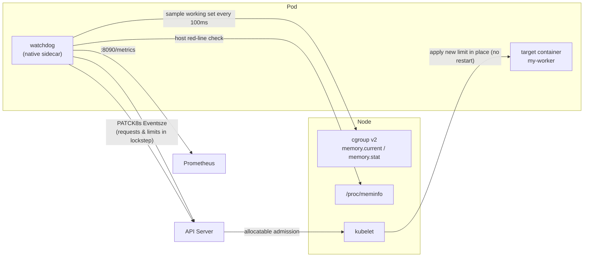
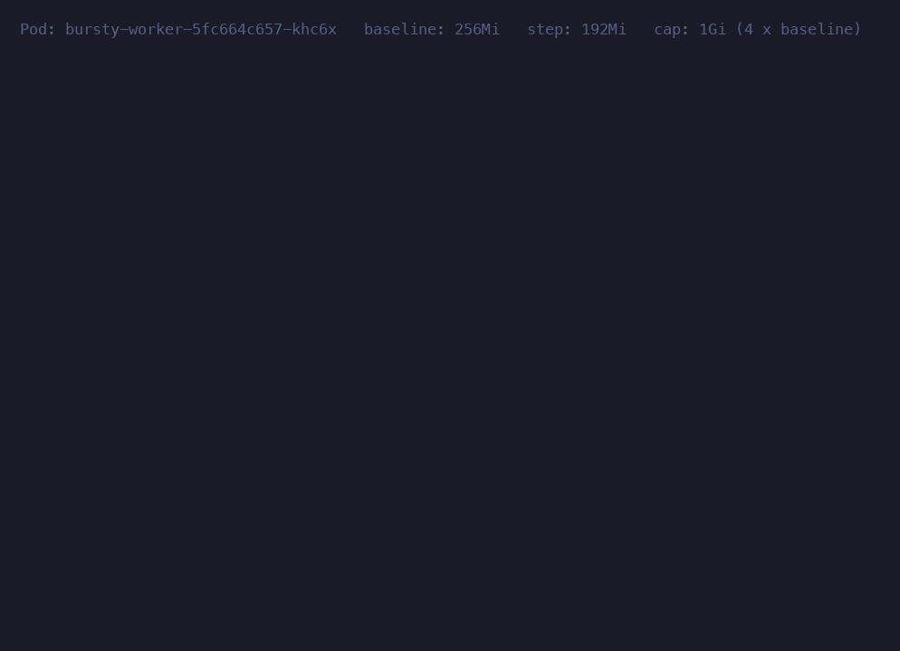

# k8s-oom-watchdog — In-Place Pod Resize Memory Watchdog Sidecar for Kubernetes

[English](README.md) | [简体中文](README.zh-CN.md)


A **workload-agnostic** container memory watchdog sidecar for any long-running, memory-bursty workload (batch jobs, data imports, report aggregation, Celery/RQ workers, ETL tasks, …): it samples the target container's cgroup v2 **working-set memory** at high frequency and, before the kernel OOM-killer fires, raises the memory limit via Kubernetes **in-place pod resize** (the `/resize` subresource), then shrinks it back once the burst is over — without ever restarting the container or interrupting long-running tasks.

Which container to supervise is set by the `WATCHDOG_TARGET_CONTAINER` environment variable, fully decoupled from the business stack. The docs and [`examples/`](examples/) use `my-worker` as the placeholder target container; the design pressure came from a Celery heavy worker, which is why bursty long-running batch work runs through the examples.

## Architecture



## See it work



[`demo/`](demo/) ships a self-contained demo — its own namespace, RBAC and a
256Mi target container — that drives memory past the watermark and shows the
limit being raised **in place**, `restarts: 0` at the end. Two commands on any
v1.33+ cluster:

```bash
cd demo && ./setup.sh && ./demo.sh
```

## Why not VPA?

The Vertical Pod Autoscaler resizes in place too: `InPlaceOrRecreate` went GA
in [VPA 1.6.0](https://github.com/kubernetes/autoscaler/blob/master/vertical-pod-autoscaler/docs/features.md)
(February 2026) and needs the same Kubernetes 1.33+ `InPlacePodVerticalScaling`
gate this sidecar does. So the fair question is what this adds.

**VPA corrects sizing after the fact; this watchdog tries to prevent the kill.**
VPA's recommender raises memory *once a container has been OOMKilled*, bumping
the request to the last observed peak plus 20% (`OOMBumpUpRatio`) so the *next*
burst survives. Its input is a metrics pipeline, which adds latency of its own —
[independent analysis](https://scaleops.com/blog/kubernetes-vpa/) puts it at
60–90 seconds. That is the right design for long-term right-sizing, and it is
also why the first OOM is not something VPA can head off. This sidecar reads the
target container's cgroup directly every 100ms and patches `/resize` the moment
the working set crosses 80% of the limit: the decision never leaves the node and
the whole loop is seconds.

**The shape differs too.** VPA is three cluster-scoped components (recommender,
updater, admission controller) governing declared requests fleet-wide. This is
one sidecar inside one pod with no cluster-level state — its blast radius is the
pod it supervises, and if it dies that pod simply keeps its baseline limit.

**They compose.** Let VPA own the baseline a deployment starts at; let the
watchdog borrow above it during a burst and hand it back afterwards. Resizes the
watchdog did not initiate are [adopted and supervised rather than overwritten](docs/design.md#how-it-works),
so an external actor moving the spec does not start a tug-of-war.

**When you do not need this:** if your memory profile is predictable and drifts
slowly, VPA alone is simpler and enough. This project earns its place when
bursts are sharp enough that the kill lands before any recommendation loop can
react.

## Quick start

**1. Pull the image** — published for `linux/amd64` and `linux/arm64` on every
release:

```bash
docker pull ghcr.io/mryhm/k8s-oom-watchdog:latest
```

Pin a version in production (`:0.1.0` rather than `:latest`). To build your own
instead:

```bash
docker build -t <your-registry>/memory-watchdog:<tag> .
```

The image pip-installs a pinned `kubernetes` client (the resize-subresource methods require ≥ 33; older versions fall back to the raw-API path).

**2. Copy an example**: [`examples/`](examples/) holds complete, applyable
manifests — the sidecar injected into a [Deployment](examples/deployment-with-sidecar.yaml)
or a [Job](examples/job-with-sidecar.yaml), plus [RBAC](examples/rbac.yaml), an
optional [admission policy](examples/admission-policy.yaml) and a
[ServiceMonitor](examples/servicemonitor.yaml). Every piece is annotated, and
the placeholders are just your namespace and container name:

```bash
sed -e 's/my-namespace/prod/g' -e 's/my-worker/report-builder/g' \
  examples/rbac.yaml examples/deployment-with-sidecar.yaml | kubectl apply -f -
```

There is no Helm chart on purpose — a sidecar has nothing to install on its
own, it lives inside your workload. Alerting rules ship separately with your
monitoring stack (`deploy/monitoring/`).

**3. Enable**: once every prerequisite below is met, set `watchdog.enabled: true` and deploy. To verify:

```bash
kubectl logs -f <pod> -c watchdog        # watchdog logs
kubectl describe pod <pod>               # scale actions land as K8s Events on the pod
curl <pod-ip>:8090/metrics               # Prometheus metrics
```

## Prerequisites

| Condition | Requirement | Behavior when unmet |
|---|---|---|
| Kubernetes version | **≥ 1.33** (EKS ≥ 1.34); both the `/resize` subresource and native sidecars (initContainer with `restartPolicy: Always`) are GA | On the first PATCH returning 404/405 the watchdog logs an explicit CRITICAL message and exits; repeated restarts fire the `MemoryWatchdogSidecarRestarting` alert |
| Cgroup | v2 (systemd driver; the EKS AL2023 default) | Fails to locate the cgroup at startup and exits |
| Pod Security | The namespace must allow read-only hostPath mounts (`/sys/fs/cgroup`, `/proc/meminfo`); the PSA `restricted` profile rejects them | Pod cannot be created |
| Alerting (monitoring stack) | Carried entirely by the monitoring stack: `deploy/monitoring/prometheus-rules.yaml` (7 PrometheusRules) + `deploy/monitoring/alertmanager-config.yaml` (delivered to your IM alert channel via an alert gateway; example channel name `your-alert-channel`), rolled out with the monitoring stack | Without the rules you only get metrics and K8s events, no active alerting — confirm the rules are deployed before enabling the watchdog |

## How it works (overview)

Implementation details and design reasoning for each item live in **[docs/design.md](docs/design.md)**.

1. **Locating the cgroup**: at startup, finds the target container's cgroup directory via mountinfo or a POD_UID glob (private cgroup namespaces supported); relocates automatically after a main-container restart instead of going blind.
2. **Working-set accounting**: `memory.current − inactive_file`, matching the kubelet's OOM accounting — IO-heavy tasks don't trigger spurious scale-ups from inflated page cache.
3. **Scale-up**: at working set ≥ 80% of limit, PATCHes `/resize` by one step, raising **requests and limits together** — borrowed memory always enters scheduling accounting, so the host and neighbor pods stay safe.
4. **Host red line**: a scale-up passes only while `new limit + everything else on the host < 90% × physical memory`; short on space, the step degrades adaptively; no space at all trips a circuit breaker and alerts.
5. **Failure handling**: Infeasible or a 60s timeout → roll back the spec + high-severity alert + a 10-minute circuit breaker. Never waits forever.
6. **Scale-down**: only after the working set stays < 40% for 180s, stepping down gradually — a wide hysteresis band against the scale-up line; an in-flight scale-down is withdrawn immediately under new pressure, and external resizes are adopted and supervised, never overwritten.
7. **Baseline persistence**: initial limit/requests are stored in pod annotations; a sidecar restart loses no bookkeeping.
8. **Failing loudly**: when host memory info is unreadable, refuses to scale up and alerts continuously — never silently skips.
9. **Native sidecar**: starts before and terminates after the main container, covering the full lifecycle including very long graceful shutdowns; runs non-root with a read-only root filesystem and all capabilities dropped.
10. **Observability**: Prometheus metrics + K8s Events + a heartbeat-driven `/healthz`; alerting is carried by the monitoring stack (7 PrometheusRules) — the watchdog only does second-level closed-loop handling and emits data points.

## Deployment parameters (`values.yaml`)

```yaml
worker:
  watchdog:
    enabled: false           # off by default; verify the cluster meets the prerequisites first
    threshold: 0.8           # scale-up watermark (working set / limit)
    pollInterval: 0.1        # sampling period (seconds)
    memoryStep: "2Gi"        # scale-up step
    maxMemoryFactor: 2.0     # cap = this factor × baseline (auto-adapts per tenant); must be > 1.0
    hostCeiling: 0.90        # host physical-memory red line
    allowBlindScaleup: false # allow a blind half-step scale-up when host memory info is unreadable
    metricsPort: 8090        # port for /metrics and /healthz
    repository: "registry.example.com/memory-watchdog"
    tag: "v1.8"
```

Alerting is not part of the workload manifests — it is rolled out by the monitoring stack (see the Prerequisites table). The scale-up cap has exactly one mode, `maxMemoryFactor × baseline`; an absolute cap is deliberately not provided (see the trade-off discussion in [docs/design.md](docs/design.md#design-trade-off-the-scale-up-cap)).

## Known limitations (summary)

The full reasoning behind each item lives in **[docs/design.md](docs/design.md#known-limitations-with-reasoning)**.

- **The rescue window has a physical upper bound**: bursts allocating faster than "headroom ÷ rescue-path latency" (roughly ≥ 1GiB/s at a 16Gi baseline) still OOM — inherent to in-place resize; for known bursty tasks lower `threshold` or raise the baseline.
- **Same-node multi-watchdog race**: the kubelet's allocatable admission degrades the consequence to "the later resize is rejected and rolled back" — never host overcommit.
- **RBAC granularity**: the SA can nominally patch any pod in the namespace; a projected token + a ValidatingAdmissionPolicy (7 CEL checks) narrow it to "memory resize of the target container only".
- **Infeasible is the by-design failure direction**: on tight nodes the kubelet rejects the scale-up; automatic rollback + circuit breaker. Frequent occurrences mean genuine capacity shortage.
- **Does not trigger node autoscaling**: Infeasible produces no Pending pods, so cluster-autoscaler / Karpenter never notice; add nodes manually.
- **Sidecar down = ceiling stays at baseline**: never worse than not enabling the watchdog, but bursts lose OOM rescue; the corresponding alerts ship with the monitoring stack.
- **Requests are temporarily raised while borrowing**: initial requests are restored automatically on falling back to baseline — an overcommitted shape's scheduling headroom is fully returned.
- **The main container no longer mounts an SA token**: `automountServiceAccountToken: false`; the token is mounted only into the watchdog container.
- **The watchdog itself sits at ~70Mi resident**: never exec a kubernetes-importing diagnostic script inside its container (it would blow the 100Mi limit).

## Failure-mode handling

| Symptom | Meaning | Action |
|---|---|---|
| Alert `MemoryWatchdogResizeFailed` | Node capacity short; kubelet rejected (Infeasible) or the resize timed out unapplied | Add nodes or shard the load; the watchdog has already rolled back the spec and broken the circuit for 10 minutes |
| Alert `MemoryWatchdogHostStatsUnreadable` | `/host/proc/meminfo` mount is broken, so the host safety check cannot run | Check the hostPath mount and node health; no scale-up is performed in this state and the container has no OOM rescue |
| Alert `MemoryWatchdogHostMemoryExhausted` | The node as a whole is congested; no safe headroom | Add nodes; this is by-design protection |
| Alert `MemoryWatchdogScaleUpBlockedAtCap` | Memory pressure persists but the cap (factor × baseline) is reached | If chronic, raise that tenant's baseline or maxMemoryFactor |
| Alert `MemoryWatchdogSidecarRestarting` | Sidecar restarting repeatedly (prerequisites unmet / port taken / persistent main-loop errors / own OOM) | Read the container log's CRITICAL lines; meanwhile the target container's ceiling stays at baseline with no OOM rescue |
| Alert `MemoryWatchdogSpecReadErrors` | API server unreachable; scale decisions blocked | Check the API server / network; OOM rescue cannot run in this state |
| Alert `MemoryWatchdogSelfMemoryHigh` | The watchdog's own memory is near its 100Mi limit | Check whether someone exec'ed a heavyweight diagnostic process; if a package upgrade raised the baseline, lift the limit to 128Mi |
| The watchdog container itself OOMKilled (see the `last_terminated_reason` metric) | ~70Mi resident is a constant, so an OOMKill almost always means someone exec'ed a heavyweight diagnostic process, or a dependency upgrade raised the baseline | Check for in-container exec of kubernetes-importing scripts (forbidden); if a package upgrade raised the baseline, lift the limit to 128Mi and re-check the memory curve |

## Stress drill

The stress tool ships with this repo (`trigger_oom_test.py`); copy it into the `my-worker` container and run it (target 24G, grow 100M every 1s, hold 30s, then release):

```bash
kubectl cp trigger_oom_test.py \
  <namespace>/<pod-name>:/tmp/trigger_oom_test.py -c my-worker
kubectl exec -it <pod-name> -c my-worker -n <namespace> -- \
  python3 /tmp/trigger_oom_test.py 24 100 1 30
```

Note: if the business image's Python is not on exec's PATH (e.g. a uv-managed venv), use the interpreter's full path.

The default allocation rate (100MiB/s) is far below the rescue window's physical upper bound (see the first Known limitation), so it validates the normal path. To probe limit behavior, raise the rate toward the bound (e.g. `24 2048 0.5 30` ≈ 4GiB/s) — OOMing before the scale-up lands is then a by-design outcome in some scenarios, not a defect.

Watch from another terminal:

```bash
kubectl logs -f <pod-name> -c watchdog -n <namespace>
kubectl get pod <pod-name> -n <namespace> -o jsonpath='{.status.conditions}'  # resize conditions
curl <pod-ip>:8090/metrics                                                    # metrics
```

## Unit tests

The tests import the production module directly (no cluster, no kubernetes package needed) and cover unit conversion, scale decisions (host red-line blocking, adaptive degradation, the blind-scale-up switch, hysteresis anti-oscillation), cgroup parsing and container location, plus the **main-loop state machine** (pending supervision, Infeasible/timeout rollback, circuit breaking, scale-down withdrawal, cgroup relocation, external-resize adoption — driving the `Watchdog` class through injected fake clock/API/file readers):

```bash
python3 test_watchdog.py
```

## License

[Apache License 2.0](LICENSE)
